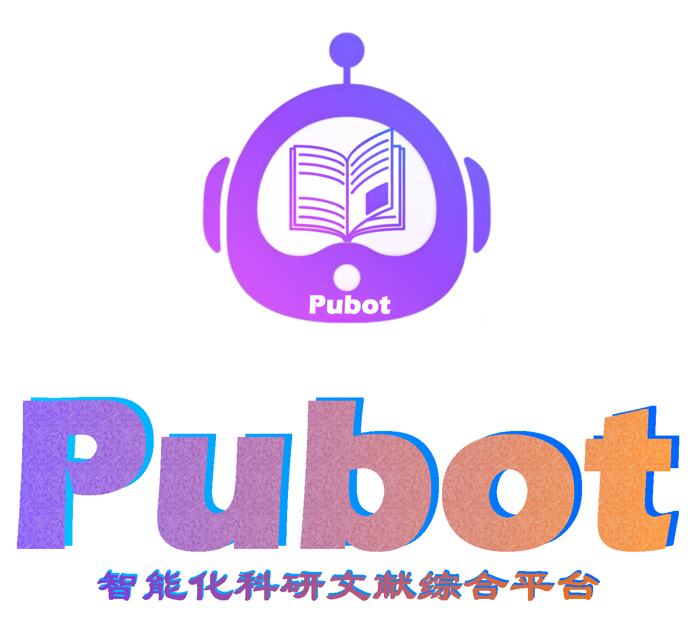

# Pubot /'pɑ:bɒt/

  

Pubot, an intelligent integrated platform for scientific literature developed by the ChosenMed AI Team, aims to assist researchers and R&D personnel in efficiently handling various tasks related to scientific literature through a proprietary large model.
